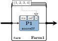

# Overview

The ForSyDe-LaTeX style packages were developed as an effort to standardize symbols and graphical primitives in documents related to the ForSyDe methodology, but also to provide tools and utilities for user convenience.

# Getting Started

The fastest way to get started is to make sure you have an installed version of [GNU Make](https://www.gnu.org/software/make/) build system and a `LaTeX` compiler, e.g. from the [Tex Live](https://www.tug.org/texlive/) suite. To install the packages, download or clone the repository, and type in the command:

```
cd path/to/forsyde-latex
make install
```

The installation script has been tested with Linux and OS X. In case the script fails, refer to the installation section in the [user manual](assets/pdf/refman.pdf). A quick way to check that the packages and the LaTeX toolchain are installed correctly is to compile the [user manual](assets/pdf/refman.pdf), with:

```
make doc
```

Drawing with ForSyDe-LaTeX is not much different than [drawing in TikZ](https://en.wikibooks.org/wiki/LaTeX/PGF/TikZ). That is because it is actually build on top of the TikZ/PGF engine and simply offers styles or commands for instantiating ForSyDe primitives. Having this in mind, let us draw as a first example a system consisting in a farm of synchronous Moore processes.

We start by creating a file called `test.tex` somewhere in a clean directory. The code for the picture we want to draw would look along the lines of:


\documentclass{standalone}
\usepackage[tikz]{forsyde}

\begin{document}
\begin{tikzpicture}[constructors=shallow]
\standard[process, moc=sy, f={$ns$;$od$;i}, type=moore] (p1) {P1};
\cluster[farmstyle, f={$\langle 1,2,3,4 \rangle$}, type=farm] (f1) <(p1)> {Farm1};
\path (p1) edge[trans={<-,s}{f1-west}{v,srcport}] ++(-2,0)
      (p1) edge[trans={s,dstport}{f1-east}{v,->}] ++(2,0)
      (f1-f.s1) edge[f,|-|,->] (p1-f.n3);
\end{tikzpicture}
\end{document}


Let us first compile the document, which generates the following picure:

```
pdflatex test.tex
```

<p align="center">

</p>

As seen in the previous code example, the TikZ graphic primitives are imported by passing the `tikz` option when including the package `forsyde`. For a list of all options, check the [usage](#usage) section below.

The picture is drawn inside a `tikzpicture` environment. In the code above we pass the global option `constructors=shallow` in order to print the process constructor names using the [ForSyDe-Shallow](https://github.com/forsyde/forsyde-shallow) naming convention rather than the default [ForSyDe-Atom](https://github.com/forsyde/forsyde-atom). The Moore process constructor is drawn using the `\standard` node command, with the style `process`, and is named `(p1)`. The farm pattern is suggested as a cluster around the node `(p1)`, using the command `\cluser` with the style `farmstyle`. We are using the TikZ `\path` command to draw edge paths styled as signals `s` and vectors `v`. We are making use of the `trans` helper to depict the transition between the "outside" vector of signals and the signal fed to the Moore machine "inside" one worker thread.

For extensive documentation on available packages, commands, styles and options, please refer to the [reference manual](assets/pdf/refman.pdf).

# Documentation

This project is shipped with a [reference manual](assets/pdf/refman.pdf) in the `doc/` folder. The `Makefile` provided should be able to compile the document unless the LaTeX toolchain is not properly set up or there is an unmet dependency.

## Installation

This project comes with a [GNU Make](https://www.gnu.org/software/make/) instalation script which copies the library files and custom fonts in the default `LaTeX` search paths. Naturally, you need to install a LaTeX tool suite to be able to use ForSyDe-LaTeX, e.g. we recommend [Tex Live](https://www.tug.org/texlive/).

Here is a list with all the provided `make` commands:

```
make install          # (default) installs packages and fonts under TEXMFHOME
make uninstall        # uninstalls the packages and fonts from TEXMFHOME
sudo make install     # installs packages and fonts under TEXMFLOCAL
sudo make uninstall   # uninstalls the packages and fonts from TEXMFLOCAL
make doc              # compiles the reference manual
make clean            # cleans the intermediate files generated for the reference manual
make superclean       # removes manual and generated files
```

**OBS:** depending on your OS or your chosen installation method, you might need to run `sudo texhash` to rebuild the TeX path database.

If you cannot use GNU Make or your `LaTeX` suite does not contain the tools necessary, refer to the installation section in the [user manual](https://forsyde.github.io/forsyde-latex/assets/pdf/refman.pdf). The installation script will try to create a corresponding folder tree under `TEXMFLOCAL` (on Ubuntu `/usr/local/share/texmf`) and if it does not have write access, it will revert to `TEXMFHOME` (usually `$(HOME)/texmf`).

## Usage

To import the libraries you need to write in the preamble of your document:

```
\usepackage[options]{forsyde}
```

where `options` is a list of packages you want to load:

 * `tikz` : loads a collection of PGF and TikZ styles, graphical primitives and draw commands
 * `math` : loads a collection of math symbols and math environment commands
 * `plot` : loads a collection of alternative TikZ plotting commands, to be used with the dumped signal data.
 * `legacy` : API for previous versions of this project


# Examples

Here are listed a set of pre-compiled examples. Click on any of them to see their source code.

## TikZ process networks examples

<ul class="examples">


 <li>
	<a href="examples/{{examp.raw}}.html">
		<p align="center">
		
		</p>
		<p align="center">{{ examp.description }}</p>
	</a>
</li>


</ul>

## Signal plotting examples


<ul class="examples">


 <li>
	<a href="examples/{{examp.raw}}.html">
		<p align="center">
		
		</p>
		<p align="center">{{ examp.description }}</p>
	</a>
</li>


</ul>

## Math examples

<ul class="examples">


 <li>
	<a href="examples/{{examp.raw}}.html">
		<p align="center">
		
		</p>
		<p align="center">{{ examp.description }}</p>
	</a>
</li>


</ul>

## Miscellaneous examples


<ul class="examples">


 <li>
	<a href="examples/{{examp.raw}}.html">
		<p align="center">
		
		</p>
		<p align="center">{{ examp.description }}</p>
	</a>
</li>


</ul>

# Contribution

The package files are documented and contributions should be self-explanatory. Any changes should be performed on a personal fork and contributions should be documented and evaluated by initiating pull requests. All new feature must also be documented in the reference manual. Check the project's [Wiki page](https://github.com/forsyde/forsyde-shallow/wiki) for more information and specific instructions on how to contribute.
